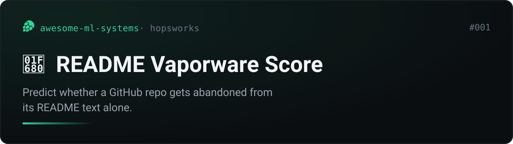
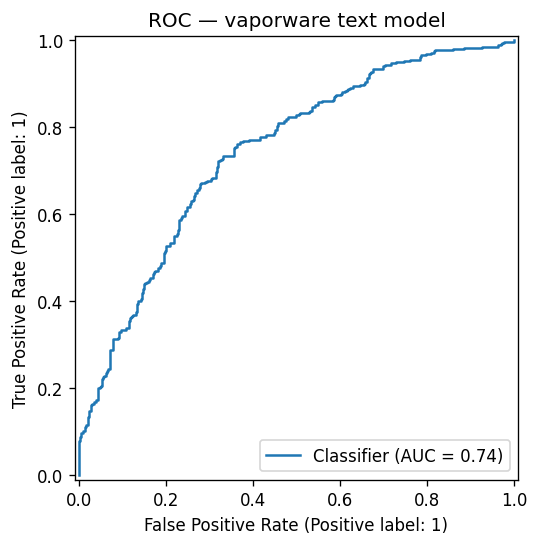
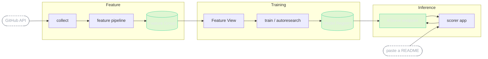
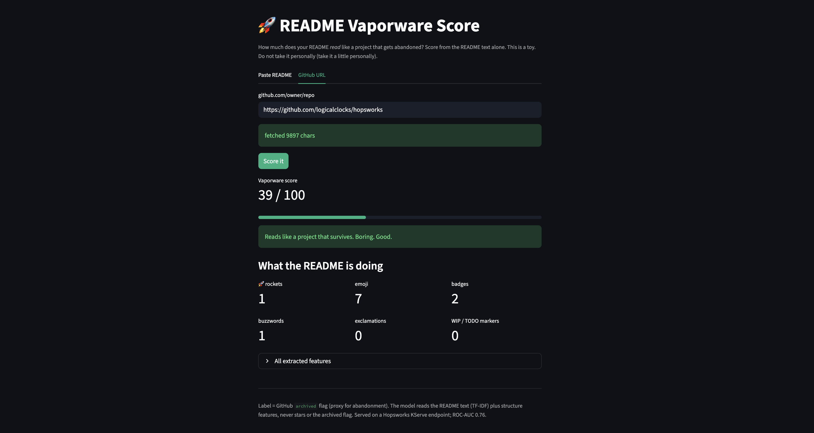

# README Vaporware Score



Can you predict whether a GitHub repo gets abandoned from its README alone?
Emoji count, badge density, "🚀 blazingly fast" frequency, the actual words.

Short answer, and not the one you would expect: the *structure* of a README
(emoji, badges, headings) barely predicts abandonment. The *words* do. A model
built on README structure counts tops out at **ROC-AUC 0.62**. Reading the actual
text with TF-IDF reaches **0.76**. The live scorer serves the text model.

This repo has the data (3600 labelled repos), the FTI pipelines, the autonomous
optimization run, and a served scorer, all on [Hopsworks](https://www.hopsworks.ai/).

## The result

Two README-only models on the same 3600 repos, balanced 1800 abandoned / 1800
active, drawn from the same 2021 to 2023 creation cohort.

### Reading the words (the deployed model)

TF-IDF over the raw README text (word and character n-grams) plus the structure
counts. This is what the live scorer serves, on a Hopsworks KServe endpoint.

| metric | value |
|---|---:|
| ROC-AUC (5-fold CV) | 0.762 |
| ROC-AUC (holdout) | 0.745 |
| average precision | 0.738 |
| accuracy | 0.688 |
| F1 | 0.688 |



The words carry most of the signal. How the search got from counts to text is in
[`autoresearch/`](autoresearch/).

### README structure as counts (the surprising negative result)

Reduce the README to 27 numeric counts (length, headings, badges, emoji, and so
on) and the best model tops out at ROC-AUC 0.62. The interesting part is *which*
counts matter, and which do not.


Abandoned repos have **shorter, thinner** READMEs: fewer characters, fewer
headings, fewer sections, fewer badges, and yes, fewer emoji.

| feature | abandoned mean | active mean |
|---|---:|---:|
| README words | 677 | 1005 |
| heading count | 9.3 | 12.3 |
| badge count | 1.5 | 2.6 |
| emoji count | 2.0 | 3.6 |
| 🚀 rocket count | 0.04 | 0.12 |
| buzzword count | 0.82 | 1.31 |

So the "🚀 blazingly fast" theory is wrong. Repos that ship rockets and badges are
*more* likely to still be alive, because maintained projects keep investing in
their READMEs. The structure of a README is a vanity signal. What you actually
write is what predicts whether you stick around.

## Caveats

Read these before quoting the number anywhere.

- **The label is a proxy.** "Abandoned" means the GitHub `archived` flag is set.
  Some archived repos were finished, renamed, or moved, not failed. "Active"
  means pushed to after 2026-01-01. There is no ground-truth "died within 6
  months" signal here.
- **Era is a partial confound.** Both classes are sampled from repos created
  2021 to 2023 to keep README conventions comparable, but archived repos skew a
  little older (more time to die).
- **README only.** Neither model sees stars, forks, or the archived flag. Stars
  would help and would also be cheating against the premise.
- **Selection.** Repos with at least 10 stars and a README over 80 characters, in
  whatever language GitHub reported. English-heavy by construction.
- **0.76 is useful, not oracle.** It ranks a hype-heavy thin README above a
  substantial one most of the time, not every time.

## Architecture

An FTI (feature, training, inference) system on Hopsworks.



The file-by-file map:

```
collect/collect.py            GitHub API -> data/repos.jsonl            (terminal, I/O bound)
collect/add_text.py           re-fetch raw README text for each repo    (terminal, I/O bound)
pipelines/feature_pipeline.py jsonl -> feature group                    (Hopsworks job)
pipelines/train.py            feature view -> count model -> registry   (Hopsworks job)
autoresearch/                 autonomous model search, counts vs text   (leaderboard FG + registry)
serving/register_text.py      build + register the text model w/ images (terminal, light)
serving/deploy_text.py        deploy text model -> KServe endpoint      (model serving)
app/app.py                    paste-a-README scorer -> calls endpoint   (Hopsworks app)
readme_features.py            shared feature extraction (no skew)
```

Notes that keep it honest and skew-free:

- `readme_features.py` is the single source of truth for the count features. The
  collector, the training pipeline, and the serving predictor all call the same
  `extract()`.
- The text model is heavy (60k TF-IDF features), so it runs as its own KServe
  predictor; the app sends raw README text and gets a score back, instead of
  loading the model in-process.
- Heavy fits run as Hopsworks jobs (managed compute), not in the terminal pod.

## Model optimization

[`autoresearch/`](autoresearch/) is an autonomous model-search run in the
[Karpathy autoresearch](https://github.com/karpathy/autoresearch) style
(Hopsworks adaptation:
[MagicLex/hopsworks-autoresearch](https://github.com/MagicLex/hopsworks-autoresearch)).
The loop edits one training file, runs a fixed-budget experiment, keeps wins and
reverts losses, and records every run in a leaderboard feature group plus a model
registry version. It is where the counts-to-text jump (0.62 to 0.76) was found.
See [`autoresearch/README.md`](autoresearch/README.md) for the leaderboard and
the head-to-head.

## Reproduce

Clone this repo into a Hopsworks project (any personal project; it should live on
the `/hopsfs/...` FUSE mount so the job, serving, and app steps can find it).
Inside a Hopsworks terminal, `hops` and `hopsworks.login()` authenticate
automatically. `make collect` and `make text` also need `gh auth login`.

```bash
make collect       # pull ~3600 labelled repos -> data/repos.jsonl   (needs gh auth)
make features      # load the feature group                          (Hopsworks job)
make eda           # correlations + plots -> models/eda/             (local)
make train         # count model -> registry                         (Hopsworks job)
make text          # re-fetch raw README text -> data/repos_text.jsonl (needs gh auth)
make serve-model   # build + register the text model, deploy to KServe
make deploy-app    # build the app env (first run) + deploy the scorer app
```

`data/repos.jsonl` is committed, so you can skip `make collect`. Everything uses
the standard Hopsworks base environments and clones them where it needs pinned
versions. No names are hardcoded to one user or project.

## The scorer

Paste a README (or a GitHub URL), get a 0 to 100 score. Lower is better. It reads
your actual words, not just your badge count, and it has opinions. Do not take it
personally. Take it a little personally.


