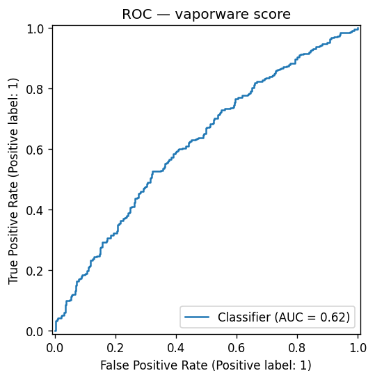
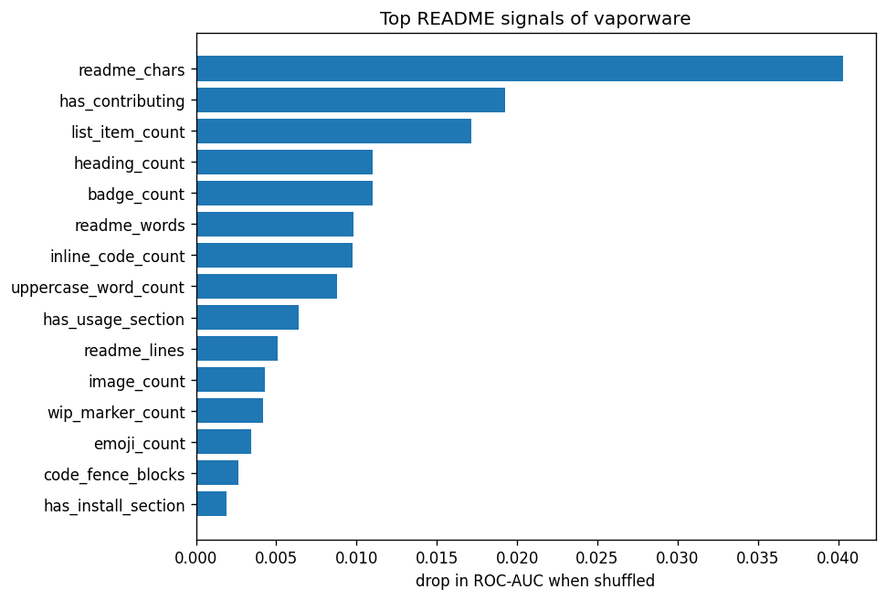

# README Vaporware Score

Can you predict whether a GitHub repo gets abandoned from its README alone?
Emoji count, badge density, "🚀 blazingly fast" frequency, that kind of thing.

Short answer: barely, and not for the reason you would expect. The hype words do
not predict abandonment. README *thinness* does, a little. The full model lands
at **ROC-AUC 0.62** on a balanced held-out set, which is well above a coin flip
and well below anything you should trust.

This repo has the data (3600 labelled repos), the pipelines, and a scorer app, so
you can check the result yourself.

## The result

Trained on 3600 repos, balanced 1800 abandoned / 1800 active, drawn from the same
2021 to 2023 creation cohort.

| metric | value |
|---|---:|
| ROC-AUC | 0.622 |
| average precision | 0.627 |
| accuracy | 0.592 |
| precision | 0.603 |
| recall | 0.622 |
| F1 | 0.612 |



The features that carry the (weak) signal, by permutation importance:



1. `readme_chars`: README length
2. `has_contributing`: mentions contributing
3. `list_item_count`: bulleted lines
4. `heading_count`: section headings
5. `badge_count`: shields/badges

The direction is the interesting part. Abandoned repos have **shorter, thinner**
READMEs: fewer characters, fewer headings, fewer sections, fewer badges, and yes,
fewer emoji.

| feature | abandoned mean | active mean |
|---|---:|---:|
| README words | 677 | 1005 |
| heading count | 9.3 | 12.3 |
| badge count | 1.5 | 2.6 |
| emoji count | 2.0 | 3.6 |
| 🚀 rocket count | 0.04 | 0.12 |
| buzzword count | 0.82 | 1.31 |

So the "🚀 blazingly fast" theory is wrong. Repos that ship rockets and badges are
*more* likely to still be alive, because maintained projects keep investing in
their READMEs. The abandoned ones tend to be the low-effort ones that never got a
second commit to the docs. Per unit of text the hype density barely moves
(`buzzword_per_1k_words` correlates +0.01 with abandonment, which is noise).

## Caveats

Read these before quoting the number anywhere.

- **The label is a proxy.** "Abandoned" means the GitHub `archived` flag is set.
  Some archived repos were finished, renamed, or moved, not failed. "Active"
  means pushed to after 2026-01-01. There is no ground-truth "died within 6
  months" signal here.
- **Era is a partial confound.** Both classes are sampled from repos created
  2021 to 2023 to keep README conventions comparable, but archived repos skew a
  little older (more time to die).
- **README only.** The model never sees stars, forks, or the archived flag. Stars
  would help and would also be cheating against the premise.
- **Selection.** Repos with at least 10 stars and a README over 80 characters, in
  whatever language GitHub reported. English-heavy by construction.

## Architecture

Built on [Hopsworks](https://www.hopsworks.ai/) as an FTI (feature, training,
inference) system.

```
collect/collect.py      GitHub API -> data/repos.jsonl        (terminal, I/O bound)
pipelines/feature_pipeline.py   jsonl -> feature group         (Hopsworks job)
pipelines/train.py      feature view -> model registry         (Hopsworks job)
app/app.py              model -> paste-a-README scorer          (Hopsworks app)
readme_features.py      shared feature extraction (no train/serve skew)
```

The feature extraction in `readme_features.py` is the single source of truth: the
collector and the app call the same `extract()`, and the model carries its own
feature order in `feature_names_in_`, so there is no training/serving skew.

## Reproduce

Clone this repo into a Hopsworks project (any personal project works; the FUSE
mount at `/hopsfs/...` is where it should live so the job and app deploy steps
can find it). Inside a Hopsworks terminal, `hops` and `hopsworks.login()`
authenticate automatically. For `make collect` you also need `gh auth login`
(5000 req/hour authenticated; the collector is rate-limit aware and resumable).

```bash
make collect      # pull ~3600 labelled repos -> data/repos.jsonl  (needs gh auth)
make features     # upload data + load the feature group           (Hopsworks job)
make eda          # correlations + plots -> models/eda/             (local)
make train        # feature view -> train -> register model        (Hopsworks job)
make app          # run the scorer locally
make deploy-app   # build the app env (first run, few min) + deploy as a Hopsworks app
```

The dataset (`data/repos.jsonl`) is committed, so you can skip `make collect`
and go straight to `make features`. Everything uses the standard Hopsworks base
environments (`python-feature-pipeline`, `pandas-training-pipeline`,
`python-app-pipeline`), and `make deploy-app` clones the last one and pins the
model's exact library versions for you. No names are hardcoded to one user or
project.

## The scorer

Paste a README, get a 0 to 100 score. Lower is better. It will tell you a short
README scores as vaporware, because that is what the data says. Do not take it
personally. Take it a little personally.
